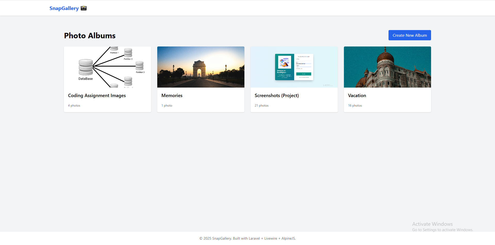
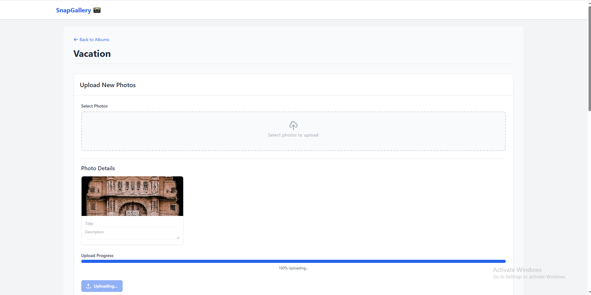
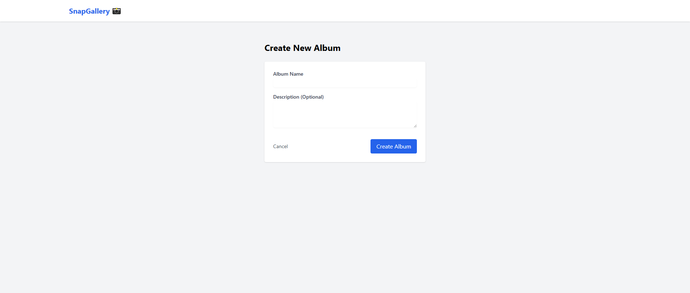
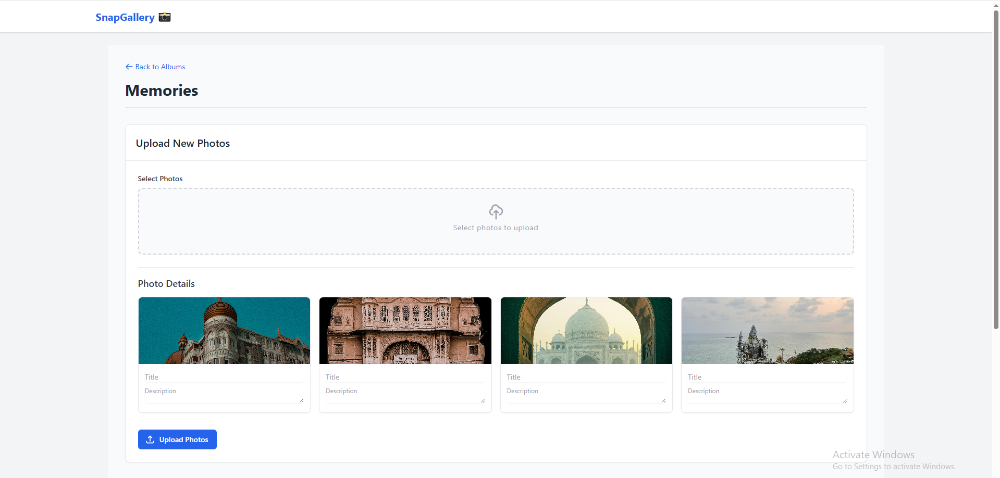
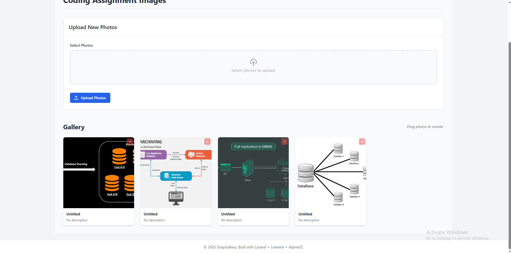
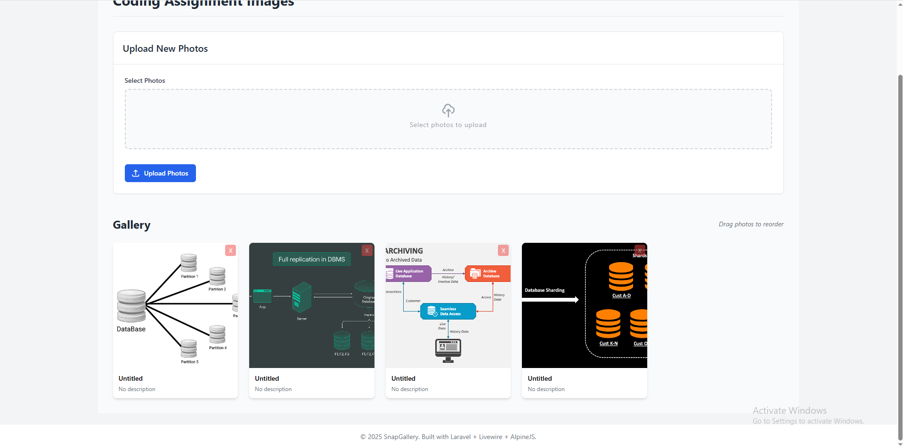
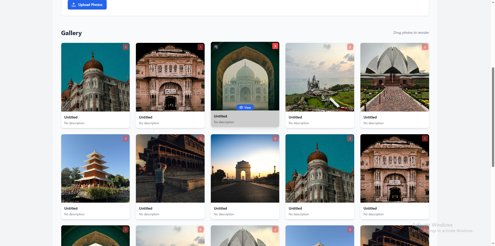
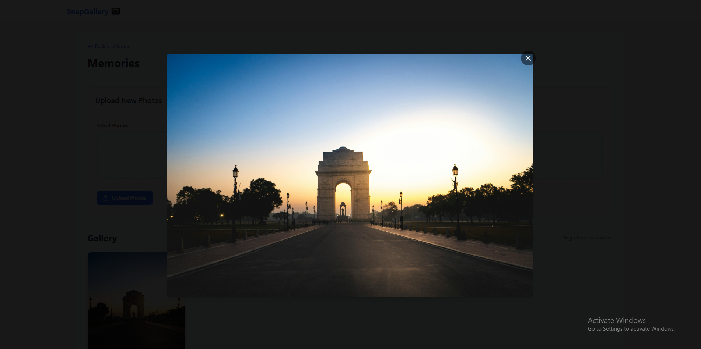

# SnapGallery (Laravel + Livewire + AlpineJS)

SnapGallery is a modern, interactive photo gallery web application built with the TALL stack (Tailwind CSS, Alpine.js, Laravel, Livewire). It allows users to organize photos into albums, upload new images with real-time progress feedback, view images in a fullscreen modal, reorder photos using drag-and-drop, and benefits from optimized loading thanks to image lazy-loading.

## ✨ Key Features

*   **Multi-Album Support:** Organize photos into distinct albums with names and descriptions.
*   **Photo Uploads:**
    *   Upload multiple photos to a specific album.
    *   Add titles and descriptions to photos during upload.
    *   **Real-time Upload Progress Bar:** Visual feedback on upload progress powered by Livewire and Alpine.js.
*   **Interactive Gallery View:**
    *   **Drag-and-Drop Sorting:** Easily reorder photos within an album using SortableJS integrated via Alpine.js. The order is persisted in the database.
    *   **Fullscreen Image Preview:** Click on any gallery image to view it in a responsive fullscreen modal (lightbox). Close with Esc key, close button, or clicking the background.
    *   **Image Lazy Loading:** Gallery thumbnails use native `loading="lazy"` for optimized performance, loading images only as they approach the viewport.
*   **Album & Photo Management:** Create albums, delete albums (and their associated photos), delete individual photos.
*   **Dynamic UI:** Leverages Livewire for seamless backend interactions without full page reloads and Alpine.js for client-side interactivity.
*   **Responsive Design:** Styled with Tailwind CSS for usability across different screen sizes.

## 📸 Screenshots 

### 📌 Mutiple Albums


### 📌 Real time progress bar


### 📌 Create Albums


### 📌 upload photos to album


### 📌 Drag-and-Drop Sorting


### 📌 Drag-and-Drop Sorting


### 📌 Gallery


### 📌 full screen view


## 🚀 Tech Stack

*   **Backend:** Laravel (v10.x or latest)
*   **Frontend:**
    *   Livewire (v3.x)
    *   Alpine.js (v3.x)
    *   Tailwind CSS (v3.x)
    *   SortableJS (for drag-and-drop)
*   **Database:** MySQL / PostgreSQL / SQLite (Configurable via Laravel's `.env`)
*   **Build Tools:** Vite (configured with Laravel) / Node.js & NPM/Yarn

  ## 📁 Project Structure
  ```
  ├── app/
│ ├── Http/
│ │ └── Controllers/
│ │ └── Controller.php
│ ├── Livewire/
│ │ ├── AlbumList.php
│ │ ├── CreateAlbumForm.php
│ │ └── PhotoGallery.php
│ ├── Models/
│ │ ├── Album.php
│ │ ├── Photo.php
│ │ └── User.php
│ └── Providers/
│ └── AppServiceProvider.php
├── bootstrap/
│ ├── cache/
│ ├── app.php
│ └── providers.php
├── config/
│ ├── app.php
│ ├── auth.php
│ ├── cache.php
│ ├── database.php
│ ├── filesystems.php
│ ├── logging.php
│ ├── livewire.php
│ ├── mail.php
│ ├── queue.php
│ ├── services.php
│ └── session.php
├── database/
│ ├── factories/
│ └── migrations/
│ ├── 0001_01_01_000000_create_users_table.php
│ ├── 0001_01_01_000001_create_cache_table.php
│ ├── 0001_01_01_000002_create_jobs_table.php
│ ├── 2025_04_28_040811_create_photos_table.php
│ ├── 2025_04_28_064211_add_order_column_to_photos_table.php
│ ├── 2025_04_28_093733_create_albums_table.php
│ └── 2025_04_28_093809_add_album_id_to_photos_table.php
├── public/
│ └── (Build assets like index.php, assets folder via Vite, etc.)
├── resources/
│ ├── css/
│ │ └── app.css
│ ├── js/
│ │ ├── app.js
│ │ └── bootstrap.js
│ └── views/
│ ├── components/
│ │ └── layouts/
│ │ └── app.blade.php
│ ├── livewire/
│ │ ├── album-list.blade.php
│ │ ├── create-album-form.blade.php
│ │ └── photo-gallery.blade.php
│ └── welcome.blade.php
├── routes/
│ ├── console.php
│ └── web.php
├── storage/
│ ├── app/
│ ├── framework/
│ └── logs/
│ ├── .gitignore
│ └── laravel.log
├── tests/
├── vendor/
├── .editorconfig
├── .env
├── .env.example
├── .gitattributes
├── .gitignore
├── README.md
├── artisan
├── composer.json
├── composer.lock
├── package.json
├── phpunit.xml
└── vite.config.js
```

## 🔧 Installation & Setup

1.  **Clone the repository:**
    ```bash
    git clone https://github.com/[YOUR_GITHUB_USERNAME]/SnapGallery.git
    cd SnapGallery
    ```
    *(Replace `[YOUR_GITHUB_USERNAME]` with your actual GitHub username)*

2.  **Install PHP Dependencies:**
    ```bash
    composer install
    ```

3.  **Install Node.js Dependencies:**
    ```bash
    npm install
    # or if you use yarn:
    # yarn install
    ```

4.  **Build Frontend Assets:**
    ```bash
    npm run dev
    # Or for production: npm run build
    ```

5.  **Environment Setup:**
    *   Copy the example environment file:
        ```bash
        cp .env.example .env
        ```
    *   Generate the application key:
        ```bash
        php artisan key:generate
        ```

6.  **Configure Database:**
    *   Open the `.env` file in your text editor.
    *   Update the `DB_*` variables (e.g., `DB_DATABASE`, `DB_USERNAME`, `DB_PASSWORD`) to match your local database setup. Make sure the database exists.

7.  **Run Database Migrations:**
    *   This will create the `albums` and `photos` tables with the necessary columns (including `album_id` and `order`).
    ```bash
    php artisan migrate
    ```

8.  **Create Storage Link:**
    *   This is crucial for making uploaded images publicly accessible.
    ```bash
    php artisan storage:link
    ```

9.  **Serve the Application:**
    ```bash
    php artisan serve
    ```

10. **Access the Application:**
    *   Open your web browser and navigate to `http://127.0.0.1:8000` (or the address provided by `php artisan serve`). You should be redirected to the `/albums` page.

## ⚙️ Usage

*   Navigate to the application URL (usually `http://127.0.0.1:8000/albums`).
*   Create a new album using the "Create New Album" button.
*   Click on an album to view its gallery.
*   Inside an album:
    *   Upload photos using the form at the top. Observe the progress bar.
    *   Click and drag photos (using the drag handle that appears on hover) to reorder them.
    *   Click on a photo thumbnail to view it in fullscreen.
    *   Delete individual photos using the 'X' button.
*   On the album list page, you can delete entire albums (this will also delete all photos within that album due to database constraints).

## 🤝 Contributing

Contributions are welcome! If you find a bug or have a feature request, please open an issue on GitHub. If you'd like to contribute code:

1.  Fork the repository.
2.  Create a new branch (`git checkout -b feature/your-feature-name`).
3.  Make your changes.
4.  Commit your changes (`git commit -m 'Add some feature'`).
5.  Push to the branch (`git push origin feature/your-feature-name`).
6.  Open a Pull Request.

## 📜 **License**

This project is licensed under the [MIT License](LICENSE).

---

## 👨‍💻 **Author**

**Kombee Technologies**

- 🌐 [Portfolio](https://github.com/kombee-technologies)
- 💼 [LinkedIn](https://in.linkedin.com/company/kombee-global)
- 🌍 [Website](https://www.kombee.com/)

---

<p align="center">
  Built with ❤️ using Laravel
</p>

---
